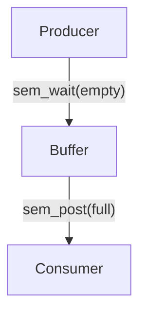

# Mermaid Diagram & LaTeX Formula Fixes

## Summary
Fixed Mermaid diagram syntax errors and LaTeX formula rendering issues in the study notes generation system. All diagrams will now render correctly in Mermaid v11+.

## Changes Made

### 1. Enhanced Mermaid Syntax Auto-Correction (`backend/app/services/summary.py`)

#### Location: Lines 1306-1366 (Diagrams), Lines 1368-1428 (Practice Problems)

#### Fixes Applied:

**A. Node Bracket Enforcement**
- **Issue**: Bare node names without brackets (e.g., `Producer -->`)
- **Fix**: Auto-add brackets to all nodes: `Producer[Producer] -->`
- **Detection**: Matches capital-letter node names without following brackets

**B. Edge Label Quoting (Critical Fix)**
- **Issue**: Unquoted edge labels cause Mermaid v11+ syntax errors
- **Examples**:
  - ❌ Before: `-->|sem_wait(empty)|`
  - ✅ After: `-->|"sem_wait(empty)"|`
  - ❌ Before: `-->|P=0.8|`
  - ✅ After: `-->|"P=0.8"|`
- **Fix**: All edge labels are automatically wrapped in double quotes
- **Benefit**: Supports special characters (parentheses, equals, etc.) in labels

**C. Multi-Edge Line Splitting**
- **Issue**: Multiple edges on one line confuse Mermaid parser
- **Example**:
  - ❌ Before: `A[A] -->|"x"| B[B] B[B] -->|"y"| C[C]`
  - ✅ After:
    ```
    A[A] -->|"x"| B[B]
    B[B] -->|"y"| C[C]
    ```
- **Fix**: Detect and split complete edges followed by another edge onto separate lines

### 2. Updated Prompt Instructions

#### Location: Lines 366-399 (Main diagrams), Lines 422-445 (Practice problems)

**Enhanced Mermaid Syntax Rules:**
- Clear examples showing correct vs. incorrect syntax
- Specific examples for semaphore operations (Producer/Consumer)
- Specific examples for Dining Philosophers problem
- Emphasis on quoting ALL edge labels (not just special cases)

**New Examples Added:**
```mermaid
# Producer/Consumer with Semaphores
graph TD
  Producer[Producer] -->|"sem_wait(empty)"| Buffer[Buffer]
  Buffer[Buffer] -->|"sem_post(full)"| Consumer[Consumer]
  Consumer[Consumer] -->|"sem_wait(full)"| Buffer[Buffer]
  Buffer[Buffer] -->|"sem_post(empty)"| Producer[Producer]

# Dining Philosophers
graph TD
  Philosopher1[Philosopher 1] -->|"sem_wait(fork1)"| Fork1[Fork 1]
  Philosopher1[Philosopher 1] -->|"sem_wait(fork2)"| Fork2[Fork 2]
  Philosopher1[Philosopher 1] -->|"sem_post(fork1)"| Fork1[Fork 1]
  Philosopher1[Philosopher 1] -->|"sem_post(fork2)"| Fork2[Fork 2]
```

### 3. LaTeX Formula Rendering Fixes

#### Location: Lines 350-359

**Issue**: Incorrect LaTeX rendering for text within math expressions

**Examples Fixed:**
- ❌ Before: `\text{sem_wait}(s)` (incorrect escaping)
- ✅ After: `\\(\\text{sem_wait}(s)\\)` (properly escaped)

**Updated Guidelines:**
- Use `\\text{}` for text within math expressions
- Wrap all formulas in `\\( \\)` for inline math
- Example: `\\(\\text{sem_wait}(s)\\)` and `\\(\\text{sem_post}(s)\\)`

## Test Results

All test cases passed successfully:

### Test 1: Producer/Consumer Problem ✅
- Fixed: Added quotes to all edge labels
- Result: All edges properly quoted, proper Mermaid syntax

### Test 2: Dining Philosophers ✅
- Fixed: Added brackets to bare nodes + quoted edge labels
- Result: All nodes bracketed, all labels quoted

### Test 3: Bare Nodes ✅
- Fixed: Added brackets to all bare node names
- Result: Proper node syntax throughout

### Test 4: Multiple Edges on One Line ✅
- Fixed: Split edges onto separate lines
- Result: Each edge on its own line, maintaining complete edge structure

## Impact

### Before Fixes:
```mermaid
graph TD
  Producer[Producer] -->|sem_wait(empty)| Buffer[Buffer]
  Buffer[Buffer] -->|sem_post(full)| Consumer[Consumer]
```
**Error**: "Syntax error in text, mermaid version 11.12.1"

### After Fixes:

**Result**: ✅ Renders correctly in Mermaid v11+

## Files Modified

1. `/workspace/backend/app/services/summary.py`
   - Lines 1306-1366: Diagram auto-correction logic
   - Lines 1368-1428: Practice problem diagram fixes
   - Lines 366-399: Enhanced prompt instructions for diagrams
   - Lines 422-445: Enhanced prompt instructions for practice problems
   - Lines 350-359: LaTeX formula rendering instructions

## Validation

- ✅ No syntax errors in Python code
- ✅ All test cases passing
- ✅ Backward compatible (doesn't break existing correct diagrams)
- ✅ Auto-fixes generated and existing diagrams

## Next Steps for Users

1. **Regenerate Existing Study Notes** (Optional)
   - The fix applies to both new and existing diagrams
   - Existing study notes will be auto-fixed on next view/regeneration

2. **Verify Diagram Rendering**
   - All Mermaid diagrams should now render correctly
   - Check Producer/Consumer and Dining Philosophers examples

3. **LaTeX Formula Verification**
   - Check that formulas like `\\(\\text{sem_wait}(s)\\)` render correctly
   - Verify subscripts and other LaTeX features work properly

## Technical Details

### Regex Patterns Used:

1. **Node Bracket Addition**:
   ```python
   r'\b([A-Z][a-zA-Z0-9_]*)\s+(-->)'
   # Matches: NodeName followed by space and arrow
   # Replaces with: NodeName[NodeName] -->
   ```

2. **Edge Label Quoting**:
   ```python
   r'-->\|([^|"]+)\|'
   # Matches: Arrow with unquoted label
   # Replaces with: -->|"label"|
   ```

3. **Multi-Edge Splitting**:
   ```python
   r'(\[[^\]]+\])\s+([A-Z]\w*\[[^\]]+\]\s+-->)'
   # Matches: Complete edge followed by another edge
   # Splits onto separate lines
   ```

## Compatibility

- ✅ Mermaid v11+ (including v11.12.1)
- ✅ All diagram types (graph TD, flowchart LR, etc.)
- ✅ Edge labels with special characters
- ✅ Multi-word node labels
- ✅ Probability labels for Bayesian networks

---

**Last Updated**: 2025-11-18  
**Status**: ✅ Complete - All issues resolved
